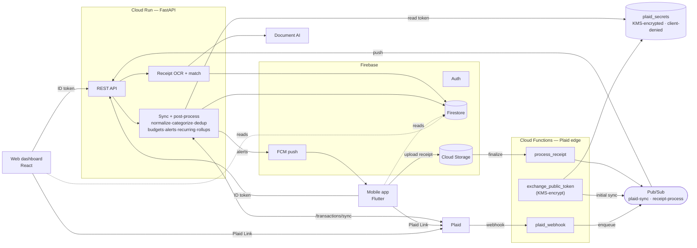
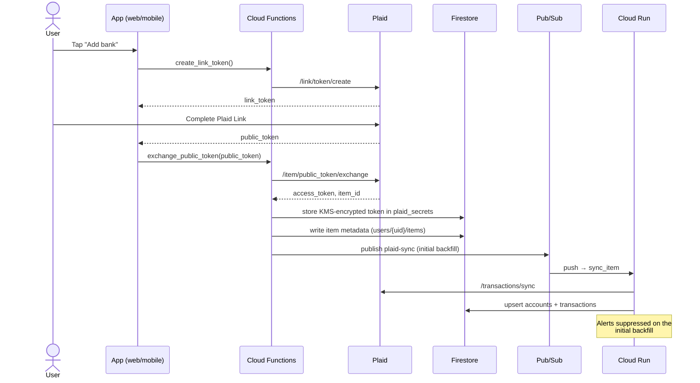
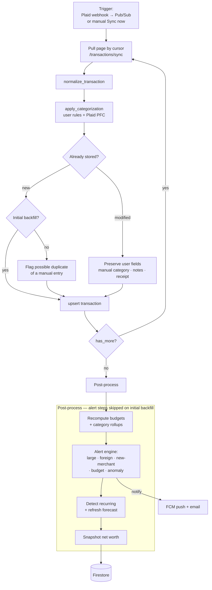
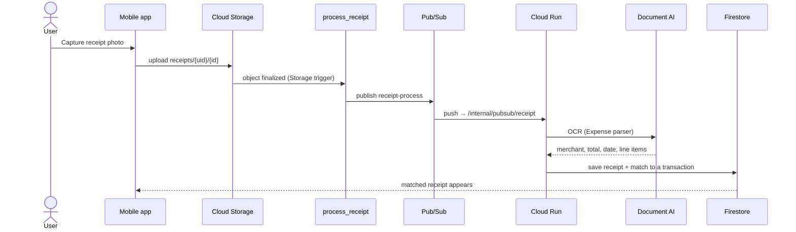
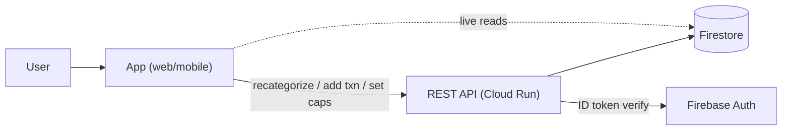

# App workflow

How data moves through the system, as Mermaid diagrams (they render on GitHub). Grounded in the
real code — Cloud Functions in [`functions/main.py`](../functions/main.py), the sync pipeline in
[`backend/app/services/sync.py`](../backend/app/services/sync.py), and the architecture in
[`../README.md`](../README.md).

---

## 1. System overview

The clients never hold bank secrets. Cloud Functions are the thin Plaid edge; the Cloud Run
FastAPI backend does the heavy lifting; Plaid access tokens live KMS-encrypted in a
client-denied store.

---

## 2. Connect a bank (Plaid Link → first sync)

---

## 3. Transaction sync pipeline

Triggered by a Plaid webhook (via Pub/Sub) or a manual **Sync now**. Each `/transactions/sync`
page is normalized, categorized, deduped, and upserted; user edits survive Plaid "modified" events.

---

## 4. Receipt capture → OCR → match

---

## 5. Everyday use (reads & manual actions)

Once data has landed, the apps work against the REST API (with a Firebase ID token) and read
Firestore directly:

- **Dashboard** — net worth, spending trend, category breakdown, recent activity.
- **Recategorize a transaction** → optionally saves a **rule** so future syncs auto-apply it.
- **Add a manual transaction** → runs the same dedup check against synced data.
- **Set budget caps** → spend is recomputed from the month's transactions on read.
- **Re-auth a broken bank** → guided Plaid Link in update mode (`create_update_link_token`).

> **Security note.** Plaid access tokens are KMS-encrypted in the `plaid_secrets` collection, which
> security rules make completely inaccessible to clients; financial data is write-protected at the
> database layer; the mobile app locks behind biometrics. See [`../README.md`](../README.md).
